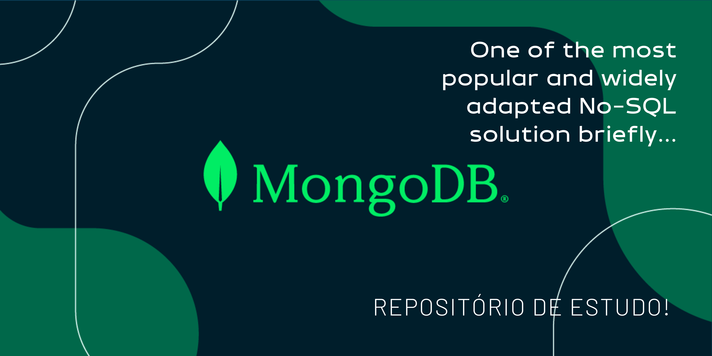

<h3> Desafio de projeto: Implementando um Banco de Dados NoSQL com Pymongo</h3>
Profª Juliana Mascarenhas

Webscraping Localiza seminovos & MongoDB
(_Em andamento)_

Webscraping usando Selenium webdriver para coleta de dados de web site da revendedora e locadora de veículos. Integração com MongoDB e utilização da biblioteca pymongo em Python para comunicação com o banco de dados. Além disso, implementação de operações CRUD para manipulação dos dados coletados.

Objetivo do projeto:

- Realizar coleta de dados do website da revendedora e locadora de veículos durantes 20 dias de 26 de fevereiro à 16 de março).

- Transformação e manipulação dos dados.

- Armazenar os dados no Mongodb Atlas.

- Apresentar operações CRUD em Python scripts utilizando a lib 'pymongo'.

Objetivos específicos:

- Explorar Selenium e agendamento de tarefas através da lib 'Schedule', utilização das bibliotecas Pandas, Matplotlib, Seaborn.

- Explorar e estudar o armazenamento e manipulação de dados no Mongodb Atlas, incluindo, criação de conta, projeto, CLUSTER, database, coleção e de documents. Manipulação de autorizações através do 'Access Manager' e 'Network Access'.

- Connection string;

- Explorar a connection entre o AtlasDB, VS Code, MongoDB Compass e escrever scripts CRUD no 'mongosh' através do terminal windows.

Links:
- [MongoDBAtlas](https://www.mongodb.com/pt-br/cloud/atlas/register)
- [MongoDB_Compass_download](https://www.mongodb.com/products/tools/compass)

- [Mongoshell_download](https://www.mongodb.com/try/download/shell)

- [MongoDB_University](https://learn.mongodb.com/)

